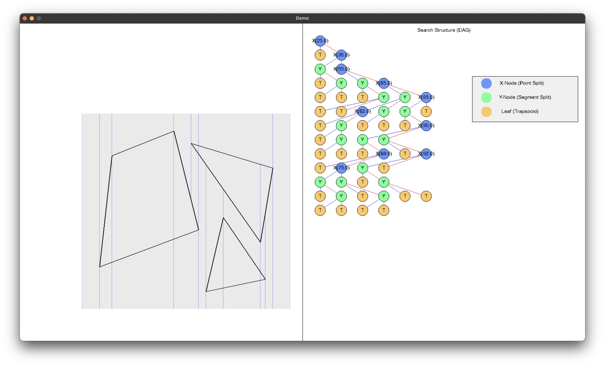
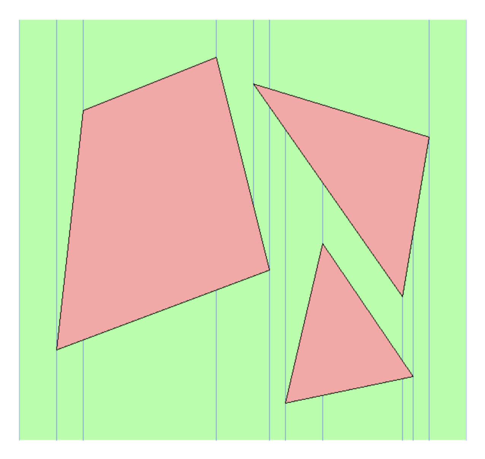
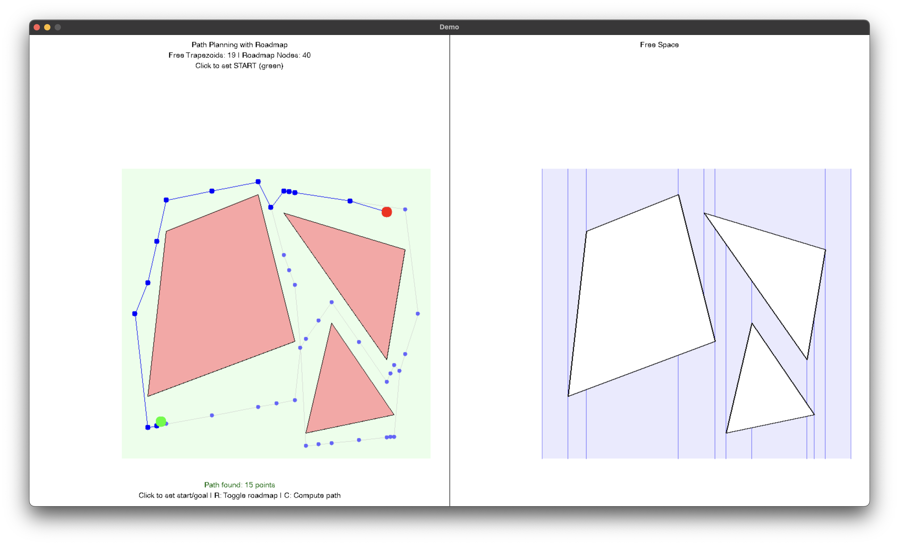
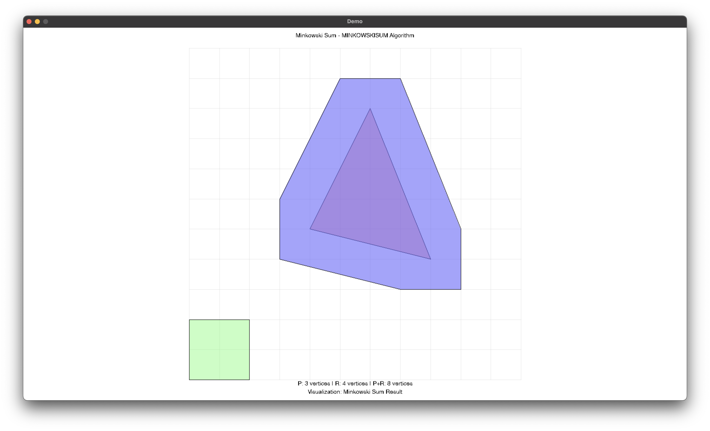

# Robot Motion

Some C++ demos for 2D robot motion planning (free-space computation, Minkowski sums, trapezoidal maps, path computation). Could encounter bugs!

## Features
- Compute free space for point robot
- Minkowski sum 
- Trapezoidal map construction
- Path computation
- Small SDL-based visualization layer for demos

## Quick start (macOS)

Dependencies

- A C++17 toolchain (g++/clang++)
- pkg-config
- SDL2 and SDL2_ttf development packages

Install common dependencies with Homebrew:

```bash
brew install pkg-config sdl2 sdl2_ttf
```

Build

The project uses the provided `Makefile`. From the project root run:

```bash
make
```

This builds the `main` executable in the repository root.

Run
### Trapezoidal Map

```bash
./main trap
```


### Freespace
```bash
./main freespace
```


### Collision free path
```bash
./main path
```


### Minkowski Sum
```bash
./main mink
```


If you want a clean rebuild:

```bash
make clean
make
```

Project layout

```
.
├── Makefile            
├── README.md           
├── include/            # public headers
│   ├── compute_free_space.hpp
│   ├── compute_path.hpp
│   ├── ...
│   └── demo/           # demo headers
├── src/                # implementation and example/demo sources
│   ├── main.cpp
│   ├── compute_free_space.cpp
│   └── ...
└── obj/                # object files
```

